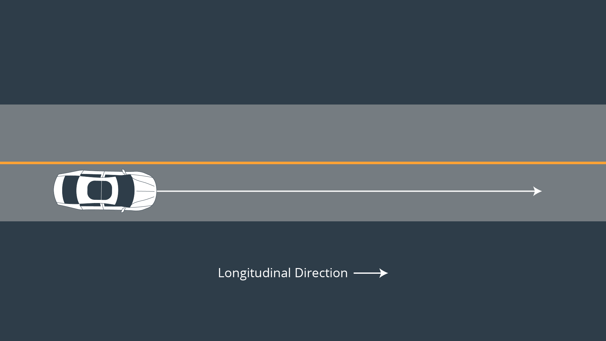

# CarND-Controls-MPC
Self-Driving Car Engineer Nanodegree Program
This project shows how the steering angle and gas throttle could be controlled using the model predictive control technique where the model try to optimize the controlled variables (steering & throttle) through predicting the optimal waypoints car shall go through depending on a set of model constraints.

## Model Description
Mainly we're utilizing the global kinematic model for this problem. 
Initially the system state consists of the following parameters: 
1- X-position of the vehicle.
2- Y-position of the vehicle.
3- Orientation angle of the vehicle heading.
4- Vehicle velocity.

The inputs/actuations where this state will be update upon which are:
1- Steering angle "psi".
2- Gas throttle/acceleration "a"

To update the following state we're using the folloing equations set:
 <equation.png>

Lf is a physical characteristic of the vehicle measures the distance between the front of the vehicle and its center of gravity. The larger the vehicle , the slower the turn rate.

### Errors
We can capture how the errors we are interested in change over time by deriving our kinematic model around these errors as our new state vector.

The new state is [x,y,ψ,v,cte,eψ][x, y, \psi, v, cte, e\psi][x,y,ψ,v,cte,eψ].

#### Cross Track Error

We can express the error between the center of the road and the vehicle's position as the cross track error (CTE). The CTE of the successor state after time t is the state at t + 1, and is defined as:

ctet+1=ctet+vt∗sin(eψt)∗dtcte_{t+1} = cte_t + v_t* sin(e\psi_t) * dtctet+1​=ctet​+vt​∗sin(eψt​)∗dt

In this case ctetcte_tctet​ can be expressed as the difference between the line and the current vehicle position y. Assuming the reference line is a 1st order polynomial f, f(xt)f(x_t) f(xt​) is our reference line and our CTE at the current state is defined as:

ctet=yt−f(xt)cte_t = y_t - f(x_t) ctet​=yt​−f(xt​)

If we substitute ctetcte_tctet​ back into the original equation the result is:

ctet+1=yt−f(xt)+(vt∗sin(eψt)∗dt)cte_{t+1} = y_t - f(x_t) + (v_t * sin(e\psi_t) * dt)ctet+1​=yt​−f(xt​)+(vt​∗sin(eψt​)∗dt)

This can be broken up into two parts:

    yt−f(xt)y_t - f(x_t) yt​−f(xt​) being current cross track error.
    vt∗sin(eψt)∗dtv_t * sin(e\psi_t) * dtvt​∗sin(eψt​)∗dt being the change in error caused by the vehicle's movement.

#### Orientation Error

eψt​ is the desired orientation subtracted from the current orientation:

eψt=ψt−ψdeste\psi_t = \psi_t - \psi{des}_t eψt​=ψt​−ψdest​

We already know ψt\psi_tψt​, because it’s part of our state. We don’t yet know ψdest\psi{des}_tψdest​ (desired psi) - all we have so far is a polynomial to follow. ψdest\psi{des}_tψdest​ can be calculated as the tangential angle of the polynomial f evaluated at xtx_txt​, arctan(f′(xt))arctan(f'(x_t))arctan(f′(xt​)). f′f'f′ is the derivative of the polynomial.

eψt+1=ψt−ψdest+(vtLf∗δt∗dt)e\psi_{t+1} = \psi_t - \psi{des}_t + (\frac{v_t} { L_f} * \delta_t * dt)eψt+1​=ψt​−ψdest​+(Lf​vt​​∗δt​∗dt)

Similarly to the cross track error this can be interpreted as two parts:

    ψt−ψdest \psi_t - \psi{des}_t ψt​−ψdest​ being current orientation error.
    vtLf∗δt∗dt\frac{v_t} { L_f} * \delta_t * dtLf​vt​​∗δt​∗dt being the change in error caused by the vehicle's movement.

### Time Horizon & Step

I've decided to select the horizon to be one second since this suits the simulated scenario here (i.e. to actuate a vehicle drived on highway for example). 

Then I started tuning the duration between the time steps firstly selected (N = 10, dt = 0.1) and observed the behavior of the model and ended up that I need to actuate more frequently to overcome the discretization problem while keeping the model not computationally heavy as possible, finally I selected (N = 20, dt = 0.05) keeping the horizon as it's but with more frequent actuations. 

### Polynomial Fitting and MPC Preprocessing
We're receiving 6 waypoints represented in the map coordinate system every time step.
Firstly we're transforming them into the vehicle coordinate system to make it easire in all the successive calculations. 
Using the homogenous transformation equations to handle the axes rotation and the origin translations as follows: 

ptsx_veh[i] = (ptsx[i] - px)*cos(-(psi)) -  (ptsy[i] - py)*sin(-(psi));
ptsy_veh[i] = (ptsy[i] - py)*cos(-(psi)) +  (ptsx[i] - px)*sin(-(psi)); 

Then fitting the transformed waypoints into a 3rd order polynomial since it's the most suitable for the reference trajectory. 
After that we set the X,Y positions of the vehicle and psi angle to zero according to the vehicle coordinate system.

We then calculate the CTE and the psi error using the fitted polynomial and its derivative. 
Now the state vector and the polynomial coeffs are ready to be passed to the optimizer to calculate new set actuations with minimal cost.

### Model Predictive Control with Latency
The following segment of code forces the model to jump back two time steps and pick old activations. 

Latency = 0.1 sec = 2 * (dt=0.05), hence the actuations shall lag the current time step by two steps and this is handled as follows:

    if (t > 2) {   // use previous actuations (to account for latency)
        a0 = vars[a_start + t - 3];
        delta0 = vars[delta_start + t - 3];
      }

### Speed and Track Completion Tuning
In order to complete one lap over the driveable portion of the track, I had to do the following tunings: 

#### 1- Cost components tuning as following: 
The major issue observed after completing the model implementation was the erratic/aggressive steering actuations (The car completed one lap but with aggressive behavior), so I tried a set of multiple tunings some of them did the job as follows:
- Increased the weight of the CTE & Epsi error components but this caused more erratic actuations (Rejected tuning).
- Increased the weight of actuation components equally to force a smoother actuation and actually this degraded the system aggressiveness (Accepted tuning).
- Increased the weight of actuation delta components equally to eliminate the erratic actuation over time and actually this enhanced the actuations stability (Accepted tuning).

#### 2- Speed Tuning
Started with a speed of 25 mph, then increased it to 40 mph and still the car do the job autonomously.
Then increased it to 60 mph and unfortunately the vehicle left the drivable lane in one of the sharp turns.
Then decreased it to 50 mph and the vehicle completed the lap but wasn't stable as it was on 40 mph.
Finally I've set the reference velocity to 40 mph.
---

## Dependencies

* cmake >= 3.5
 * All OSes: [click here for installation instructions](https://cmake.org/install/)
* make >= 4.1(mac, linux), 3.81(Windows)
  * Linux: make is installed by default on most Linux distros
  * Mac: [install Xcode command line tools to get make](https://developer.apple.com/xcode/features/)
  * Windows: [Click here for installation instructions](http://gnuwin32.sourceforge.net/packages/make.htm)
* gcc/g++ >= 5.4
  * Linux: gcc / g++ is installed by default on most Linux distros
  * Mac: same deal as make - [install Xcode command line tools]((https://developer.apple.com/xcode/features/)
  * Windows: recommend using [MinGW](http://www.mingw.org/)
* [uWebSockets](https://github.com/uWebSockets/uWebSockets)
  * Run either `install-mac.sh` or `install-ubuntu.sh`.
  * If you install from source, checkout to commit `e94b6e1`, i.e.
    ```
    git clone https://github.com/uWebSockets/uWebSockets
    cd uWebSockets
    git checkout e94b6e1
    ```
    Some function signatures have changed in v0.14.x. See [this PR](https://github.com/udacity/CarND-MPC-Project/pull/3) for more details.

* **Ipopt and CppAD:** Please refer to [this document](https://github.com/udacity/CarND-MPC-Project/blob/master/install_Ipopt_CppAD.md) for installation instructions.
* [Eigen](http://eigen.tuxfamily.org/index.php?title=Main_Page). This is already part of the repo so you shouldn't have to worry about it.
* Simulator. You can download these from the [releases tab](https://github.com/udacity/self-driving-car-sim/releases).
* Not a dependency but read the [DATA.md](./DATA.md) for a description of the data sent back from the simulator.


## Basic Build Instructions

1. Clone this repo.
2. Make a build directory: `mkdir build && cd build`
3. Compile: `cmake .. && make`
4. Run it: `./mpc`.

## Tips

1. It's recommended to test the MPC on basic examples to see if your implementation behaves as desired. One possible example
is the vehicle starting offset of a straight line (reference). If the MPC implementation is correct, after some number of timesteps
(not too many) it should find and track the reference line.
2. The `lake_track_waypoints.csv` file has the waypoints of the lake track. You could use this to fit polynomials and points and see of how well your model tracks curve. NOTE: This file might be not completely in sync with the simulator so your solution should NOT depend on it.
3. For visualization this C++ [matplotlib wrapper](https://github.com/lava/matplotlib-cpp) could be helpful.)
4.  Tips for setting up your environment are available [here](https://classroom.udacity.com/nanodegrees/nd013/parts/40f38239-66b6-46ec-ae68-03afd8a601c8/modules/0949fca6-b379-42af-a919-ee50aa304e6a/lessons/f758c44c-5e40-4e01-93b5-1a82aa4e044f/concepts/23d376c7-0195-4276-bdf0-e02f1f3c665d)
5. **VM Latency:** Some students have reported differences in behavior using VM's ostensibly a result of latency.  Please let us know if issues arise as a result of a VM environment.

## Editor Settings

We've purposefully kept editor configuration files out of this repo in order to
keep it as simple and environment agnostic as possible. However, we recommend
using the following settings:

* indent using spaces
* set tab width to 2 spaces (keeps the matrices in source code aligned)

## Code Style

Please (do your best to) stick to [Google's C++ style guide](https://google.github.io/styleguide/cppguide.html).

## Project Instructions and Rubric

Note: regardless of the changes you make, your project must be buildable using
cmake and make!

More information is only accessible by people who are already enrolled in Term 2
of CarND. If you are enrolled, see [the project page](https://classroom.udacity.com/nanodegrees/nd013/parts/40f38239-66b6-46ec-ae68-03afd8a601c8/modules/f1820894-8322-4bb3-81aa-b26b3c6dcbaf/lessons/b1ff3be0-c904-438e-aad3-2b5379f0e0c3/concepts/1a2255a0-e23c-44cf-8d41-39b8a3c8264a)
for instructions and the project rubric.

## Hints!

* You don't have to follow this directory structure, but if you do, your work
  will span all of the .cpp files here. Keep an eye out for TODOs.

## Call for IDE Profiles Pull Requests

Help your fellow students!

We decided to create Makefiles with cmake to keep this project as platform
agnostic as possible. Similarly, we omitted IDE profiles in order to we ensure
that students don't feel pressured to use one IDE or another.

However! I'd love to help people get up and running with their IDEs of choice.
If you've created a profile for an IDE that you think other students would
appreciate, we'd love to have you add the requisite profile files and
instructions to ide_profiles/. For example if you wanted to add a VS Code
profile, you'd add:

* /ide_profiles/vscode/.vscode
* /ide_profiles/vscode/README.md

The README should explain what the profile does, how to take advantage of it,
and how to install it.

Frankly, I've never been involved in a project with multiple IDE profiles
before. I believe the best way to handle this would be to keep them out of the
repo root to avoid clutter. My expectation is that most profiles will include
instructions to copy files to a new location to get picked up by the IDE, but
that's just a guess.

One last note here: regardless of the IDE used, every submitted project must
still be compilable with cmake and make./

## How to write a README
A well written README file can enhance your project and portfolio.  Develop your abilities to create professional README files by completing [this free course](https://www.udacity.com/course/writing-readmes--ud777).
